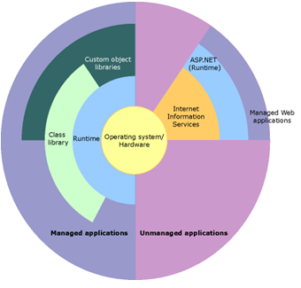
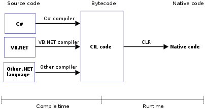

## CLR Basics
- CLR’s execution model
- Shared assemblies and strong named assemblies

## Working with Types
- Type Fundamentals
- Primitive, Reference and Value Types

## Designing Types
- Type and member basics
- Constants and Fields
- Methods: Constructors, Operators 
- Events

## Essential Types
- Array
- Strings
- Delegates
- Interface
- Generics 
   
## Collections
- Attributes
- Reflection 

## CLR facilities
- Exceptions
- Automatic Memory Management
- CLR Hosting and Appdomains
- Threading

### CLR Basics
- CLR’s execution model
- Shared assemblies and strong named assemblies

CLR’s execution model

**What is the .NET Framework?**

The Microsoft .NET Framework is a platform for building, deploying, and running Web Services and applications. It provides a highly productive, standards-based, multi-language environment for integrating existing investments with next-generation applications and services as well as the agility to solve the challenges of deployment and operation of Internet-scale applications. The .NET Framework consists of three main parts: the common language runtime, a hierarchical set of unified class libraries, and a componentized version of Active Server Pages called ASP.NET.
The following illustration shows the relationship of the common language runtime and the class library to your applications and to the overall system. The illustration also shows how managed code operates within a larger architecture.
                                             .NET Framework in context
                                                                                          

**What is the common language runtime (CLR)? What are it’s features?**

The common language runtime is the execution engine for .NET Framework applications. The CLR allows programmers to ignore many details of the specific CPU that will execute the program. It also provides other important services, including the following:
- Memory management
- Thread management
- Exception handling
- Garbage collection
- Security

**Explain the CLR execution model.**

The managed execution process includes the following steps: 
1.	Choosing a compiler. 
To obtain the benefits provided by the common language runtime, you must use one or more language compilers that target the runtime. 
2.	Compiling your code to Microsoft intermediate language (MSIL). 
Compiling translates your source code into MSIL and generates the required metadata. 
3.	Compiling MSIL to native code. 
At execution time, a just-in-time (JIT) compiler translates the MSIL into native code. During this compilation, code must pass a verification process that examines the MSIL and metadata to find out whether the code can be determined to be type safe. Alternatively, the CIL code can be compiled to native code in a separate step prior to runtime by using the Native Image Generator (NGEN). This speeds up all later runs of the software as the CIL-to-native compilation is no longer necessary.
4.	Running code. 
The common language runtime provides the infrastructure that enables execution to take place as well as a variety of services that can be used during execution.

**What is the common type system (CTS)?**

The common type system is a rich type system, built into the common language runtime, that supports the types and operations found in most programming languages. The common type system supports the complete implementation of a wide range of programming languages. 

**What is the Common Language Specification (CLS)?**

The Common Language Specification is a set of constructs and constraints that serves as a guide for library writers and compiler writers. It allows libraries to be fully usable from any language supporting the CLS, and for those languages to integrate with each other. The Common Language Specification is a subset of the common type system. The Common Language Specification is also important to application developers who are writing code that will be used by other developers. When developers design publicly accessible APIs following the rules of the CLS, those APIs are easily used from all other programming languages that target the common language runtime.

